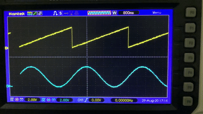

# mcp4822_linux
A user space linux driver for Microchip MCP4822 Digital-to-Analog Converter.

The code in the test.c file uses the driver functions to generate a sawtooth wave for DAC Channel A, and a sine wave for Channel B.

Tested with using Raspberry Pi 3 Model B.

Test result:

